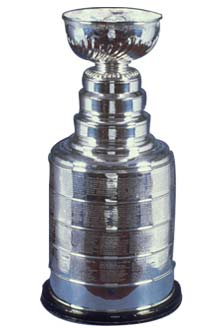

Program that pulled daily 2021 NHL season W-L updates from www.hockey-reference.com and tracked the 2021 Nashville Predators cumulative points totals against all eventual Stanley Cup winners, as well as all past Nashville Predators seasons.

<a href="https://github.com/mydogmandy/Predators_2021/blob/d2adb2ea754355e78afd2a1585add652807d527a/NHL_2021.py">Python Code Link</a>
 
 
Data was read into Pandas, cleaned, pushed to a SQLite database, then queried for the different plots
 
 
Technology used:

- Python / Pandas / NumPy
- Matplotlib / Seaborn
- SQLAlchemy / SQLite

<h1> 2021 Nashville Predators Tracker: </h1>

  
 
  

